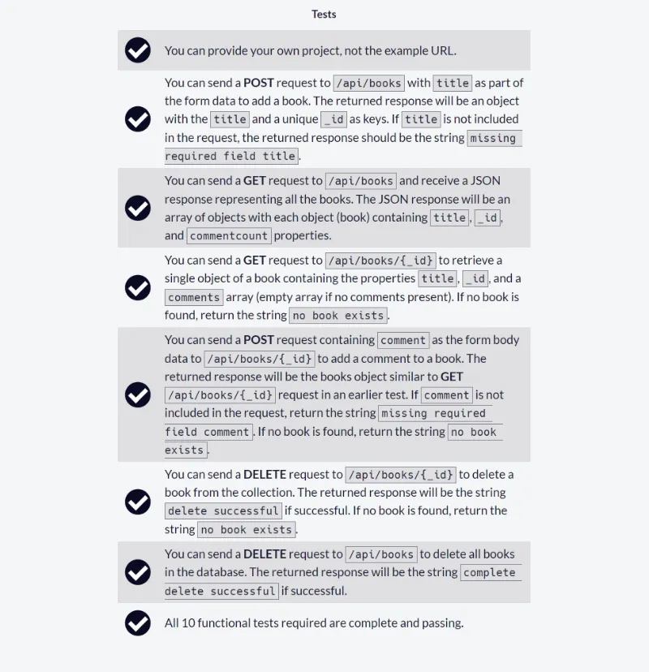
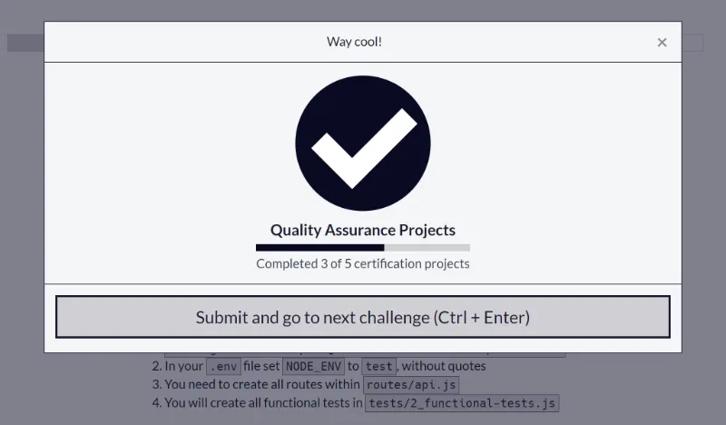
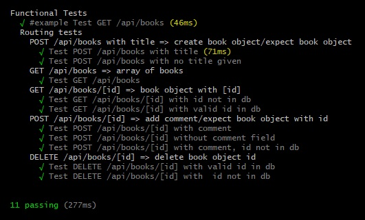
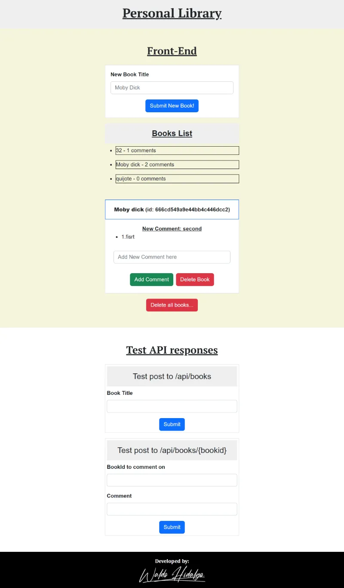

# Personal Library

[Tercer proyecto](https://www.freecodecamp.org/learn/quality-assurance/quality-assurance-projects/personal-library) requisito obligatorio para obtener la **Quality Assurance Certification** de freecodecamp.

El proyecto consiste en realizar un registrador personal de libros ya sea la creación, edición, lectura y eliminación de libros así como la agregación de comentarios a cada libro para lo cual se dispone una API REST la que vía métodos HTTP como GET, POST, PUT y DELETE permite registrar los cambios en una collection creada en una base de datos MongoDB Atlas. Además se deben crear **10 tests funcionales** que prueben el funcionamiento correcto de la App para diversos casos de prueba.

## Tabla de Contenido

- [Personal Library](#personal-library)
  - [Tabla de Contenido](#tabla-de-contenido)
  - [Requisitos](#requisitos)
  - [Proyecto Aprobado](#proyecto-aprobado)
  - [Test Funcionales Aprobados](#test-funcionales-aprobados)
  - [Test Funcionales Creados](#test-funcionales-creados)
    - [1. Test POST /api/books with title](#1-test-post-apibooks-with-title)
    - [2.Test POST /api/books with no title given](#2test-post-apibooks-with-no-title-given)
    - [3.Test GET /api/books](#3test-get-apibooks)
    - [4.Test GET /api/books/\[id\] with id not in db](#4test-get-apibooksid-with-id-not-in-db)
    - [5.Test GET /api/books/\[id\] with valid id in db](#5test-get-apibooksid-with-valid-id-in-db)
    - [6.Test POST /api/books/\[id\] with comment](#6test-post-apibooksid-with-comment)
    - [7.Test POST /api/books/\[id\] without comment field](#7test-post-apibooksid-without-comment-field)
    - [8.Test POST /api/books/\[id\] with comment, id not in db](#8test-post-apibooksid-with-comment-id-not-in-db)
    - [9.Test DELETE /api/books/\[id\] with valid id in db](#9test-delete-apibooksid-with-valid-id-in-db)
    - [10.Test DELETE /api/books/\[id\] with id not in db](#10test-delete-apibooksid-with-id-not-in-db)
  - [Screenshots](#screenshots)
    - [1. Home Page](#1-home-page)

## Requisitos



## Proyecto Aprobado



## Test Funcionales Aprobados



## Test Funcionales Creados

### 1. Test POST /api/books with title

```js
chai
  .request(server)
  .keepOpen()
  .post("/api/books")
  .send({ title: "test" })
  .end(function (err, res) {
    assert.equal(res.status, 200);
    assert.equal(res.body.title, "test");
    done();
  });
```

### 2.Test POST /api/books with no title given

```js
chai
  .request(server)
  .keepOpen()
  .post("/api/books")
  .end(function (err, res) {
    assert.equal(res.status, 200);
    assert.equal(res.text, "missing required field title");
    assert.isString(res.text);
    done();
  });
```

### 3.Test GET /api/books

```js
chai
  .request(server)
  .keepOpen()
  .get("/api/books")
  .end(function (err, res) {
    assert.equal(res.status, 200);
    assert.isArray(res.body);
    done();
  });
```

### 4.Test GET /api/books/[id] with id not in db

```js
chai
  .request(server)
  .keepOpen()
  .get("/api/books/1234")
  .end(function (err, res) {
    assert.equal(res.text, "no book exists");
    done();
  });
```

### 5.Test GET /api/books/[id] with valid id in db

```js
chai
  .request(server)
  .keepOpen()
  .post("/api/books")
  .send({ title: "test" })
  .end(function (err, res) {
    assert.equal(res.status, 200);
    chai
      .request(server)
      .keepOpen()
      .get("/api/books/" + res.body._id)
      .end(function (err, res) {
        assert.equal(res.status, 200);
        assert.isObject(res.body);
        done();
      });
  });
```

### 6.Test POST /api/books/[id] with comment

```js
chai
  .request(server)
  .keepOpen()
  .post("/api/books/")
  .send({ title: "test" })
  .end(function (err, res) {
    assert.equal(res.status, 200);

    chai
      .request(server)
      .keepOpen()
      .post("/api/books/" + res.body._id)
      .send({ comment: "test" })
      .end(function (err, res) {
        assert.equal(res.status, 200);
        assert.isObject(res.body);
        done();
      });
  });
```

### 7.Test POST /api/books/[id] without comment field

```js
chai
  .request(server)
  .keepOpen()
  .post("/api/books/")
  .send({ title: "test" })
  .end(function (err, res) {
    assert.equal(res.status, 200);
    chai
      .request(server)
      .keepOpen()
      .post("/api/books/" + res.body._id)
      .end(function (err, res) {
        assert.equal(res.status, 200);
        assert.equal(res.text, "missing required field comment");
        done();
      });
  });
```

### 8.Test POST /api/books/[id] with comment, id not in db

```js
chai
  .request(server)
  .keepOpen()
  .post("/api/books/")
  .send({ title: "test" })
  .end(function (err, res) {
    assert.equal(res.status, 200);
    chai
      .request(server)
      .keepOpen()
      .post("/api/books/1234")
      .send({ comment: "test" })
      .end(function (err, res) {
        assert.equal(res.status, 200);
        assert.equal(res.text, "no book exists");
        done();
      });
  });
```

### 9.Test DELETE /api/books/[id] with valid id in db

```js
chai
  .request(server)
  .keepOpen()
  .post("/api/books/")
  .send({ title: "test" })
  .end(function (err, res) {
    assert.equal(res.status, 200);
    chai
      .request(server)
      .keepOpen()
      .delete("/api/books/" + res.body._id)
      .end(function (err, res) {
        assert.equal(res.status, 200);
        assert.equal(res.text, "delete successful");
        done();
      });
  });
```

### 10.Test DELETE /api/books/[id] with id not in db

```js
chai
  .request(server)
  .keepOpen()
  .delete("/api/books/1234")
  .end(function (err, res) {
    assert.equal(res.status, 200);
    assert.equal(res.text, "no book exists");
    done();
  });
```

## Screenshots

### 1. Home Page


